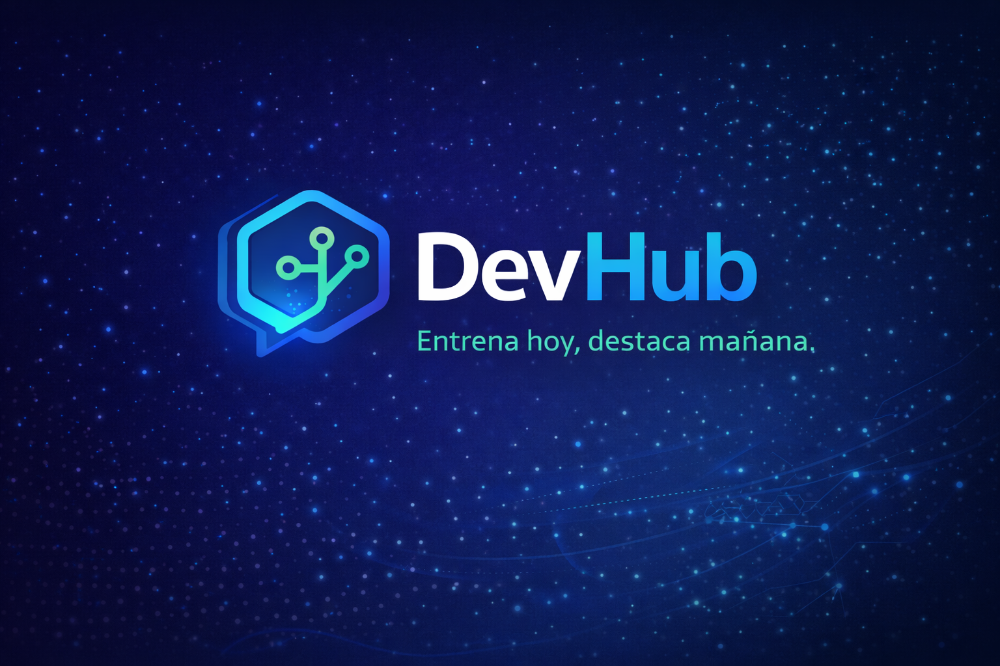

  

> "Entrena con propósito, destaca con confianza."  

# DEVHUB 💻

**Plataforma web de práctica para entrevistas técnicas en ingeniería de sistemas desarollada por SkillStack Technologies**

---

  <strong>Índice</strong> • <a href="#-problemática">Problemática</a> • <a href="#-proyecto">Proyecto</a> • <a href="#-características-del-sistema">Características</a> • <a href="#-propuesta-de-valor">Propuesta de Valor</a> • <a href="#equipo">Equipo</a>

---

## ⛔ Problemática
En Colombia existe una brecha significativa entre la formación universitaria y las competencias que demanda el mercado laboral, lo que dificulta la empleabilidad de muchos jóvenes recién graduados o en formación.

- 2 de cada 10 jóvenes en Colombia presentan dificultades para encontrar empleo (Universidad EAFIT, 2025).
- 22% de los empleadores reporta problemas para cubrir vacantes en tecnologías de la información y datos (Universidad EAFIT, 2025).
- 19% de los empleadores reporta las mismas problematicas para el área de ingeniería (Universidad EAFIT, 2025).

Una causa clave de esta situación son las entrevistas técnicas, especialmente en el área de ingeniería de sistemas, donde los distintos entrevistados afirmaron sentirse ansiosos, presionados y apresurados por entregar las soluciones/respuestas a preguntas en el menor tiempo posible (Behroozi et al., 2020).

---

## 💡 Proyecto 
La preparación para entrevistas es crucial especialmente para el contexto colombiano, DEVHUB nace como una propuesta a esta problemática 
siendo una plataforma digital práctica, orientada a personas interesadas en ingresar o consolidarse en el sector tecnológico, 
que requieran fortalecer sus habilidades técnicas y prepararse para procesos de selección laboral. El objetivo principal es mejorar 
la empleabilidad de estudiantes y profesionales mediante una preparación integral para entrevistas de trabajo.

---

## 📑 Características del Sistema 

- Banco de preguntas técnicas.
- Sistemas de práctica y retroalimentación.
- Sección de experiencias de usuario e interacción.

---

## 📈 Propuesta de Valor

DEVHUB se enfoca en un aprendizaje completo y multidisciplinar permitiendo al usuario enfocarse a aquellas preguntas que le interesen con base a su perfil y aspiraciones.  
De la misma manera se promueve la comunicación y colaboración a través de la interacción y experiencias de otros usuarios. A diferencia de otras plataformas no nos enfocamos en problemas individuales o de una sola área del conocimiento sino en un aprendizaje holístico y colaborativo que lo acerque al contexto real del mercado.

---

## 👨‍💻 Segmento de Usuarios

- Estudiantes de ingeniería de sistemas en semestres avanzados.
- Recién graduados en áreas TI.
- Personas preparándose para entrevistas técnicas.
- Profesionales que buscan reforzar fundamentos.

---

## Equipo

| Integrante | Rol |
|------------|-----|
| Iván Santiago Lastra | PM y Coordinador Frontend |
| Lucas Fuentes | Desarollador Base de Datos |
| Lorenzo Ramírez | Coordinador Backend |
| Richard Castillo | Desarollador Base de Datos |
| Ana María Murcia | Desarrolladora Frontend y Diseño |
| Adam Kalel Ordoñez | Desarrollador Backend |

## Roles según Metodología Scrum

| Integrante | Rol Scrum |
|------------|-----------|
| Adam Kalel Ordoñez | Product Owner |
| Lorenzo Ramírez | Scrum Master |
| Richard Castillo | Sprint Planner |
| Iván Santiago Lastra | Configuration Manager |
| Ana María Murcia | Quality Assurance Lead |
| Lucas Fuentes | DevOps Engineer |

---

## 📌 Responsabilidades

- Iván Santiago Lastra — PM y Coordinador Frontend
  - Dirección y planificación del proyecto.
  - Coordinación del equipo frontend y revisión de interfaces.
  - Gestión de backlog, priorización de tareas y seguimiento de sprints.
  - Revisión de PRs y validación de entregables frontend.

- Lucas Fuentes — Desarollador Base de Datos
  - Diseño y modelado del esquema de la base de datos.
  - Creación de migraciones y scripts de inicialización.
  - Optimización de consultas y mantenimiento de índices.
  - Asegurar integridad y backups de datos.

- Lorenzo Ramírez — Coordinador Backend
  - Arquitectura y coordinación del desarrollo backend.
  - Definición de APIs, autenticación y seguridad.
  - Revisión de PRs backend y mentoría del equipo.
  - Coordinación de despliegues e integracion.

- Richard Castillo — Desarollador Base de Datos
  - Implementación de esquemas, relaciones y procedimientos.
  - Optimización y tuning de consultas complejas.
  - Soporte en ETL, pruebas y generación de datos de prueba.
  - Colaboración en tareas de replicación y respaldo.

- Ana María Murcia — Desarrolladora Frontend y Diseño
  - Diseño de interfaces y prototipos (UX/UI).
  - Implementación de componentes responsivos y accesibles.
  - Consistencia visual y guías de estilo.
  - Colaboración en pruebas de usabilidad y ajustes de diseño.

- Adam Kalel Ordoñez — Desarrollador Backend
  - Implementación de endpoints y lógica de negocio.
  - Desarrollo de pruebas automatizadas (unitarias / integración).
  - Manejo de errores, validaciones y performance.
  - Integración con la base de datos y servicios externos.

  ## 📌 Responsabilidades (Metodología Scrum)

- Lorenzo Ramírez — Scrum Master
  - Organiza el trabajo del equipo por sprint.
  - Facilita la comunicación y las ceremonias Scrum.
  - Da seguimiento al avance general del proyecto.
  - Identifica y gestiona impedimentos del equipo.

- Adam Kalel Ordoñez — Product Owner
  - Lidera la recolección y análisis de requerimientos.
  - Define historias de usuario, casos de uso y criterios de aceptación.
  - Prioriza el Product Backlog según valor y dependencias.
  - Valida entregables y realiza el cierre de issues.

- Richard Castillo — Sprint Planner
  - Descompone historias de usuario en tareas técnicas.
  - Organiza y mantiene el backlog del sprint.
  - Asigna y da seguimiento a tareas durante cada sprint.
  - Asegura coherencia entre backlog, issues y sprints.

- Iván Santiago Lastra — Configuration Manager
  - Administra el repositorio del proyecto.
  - Define y controla el flujo de trabajo (Gitflow) para ramas.
  - Revisa y aprueba pull requests.
  - Supervisa commits, fusiones y versionado del sistema.

- Ana María Murcia — Quality Assurance Lead (QA Lead)
  - Verifica que las entregas cumplan los criterios de evaluación.
  - Controla el cumplimiento de tareas definidas en cada sprint.
  - Revisa la calidad funcional, técnica y documental.
  - Reporta defectos, desviaciones y riesgos del proyecto.

- Lucas Fuentes — DevOps Engineer
  - Diseña y mantiene los pipelines de integración y despliegue continuo (CI/CD).
  - Automatiza pruebas y procesos de integración de módulos.
  - Gestiona el despliegue del sistema utilizando Docker.
  - Configura y mantiene los entornos de desarrollo, pruebas y producción.

---

## Referencias

Behroozi, M., Shirolkar, S., Barik, T., Parnin., & Parnin, C. (2020). Does stress impact technical interview performance? Recuperado de:  https://chrisparnin.me/pdf/stress_FSE_20.pdf

Universidad EAFIT. (2025). Educación superior y mercado laboral en Colombia: desafíos y oportunidades en un entorno de transformación. Recuperado de: https://universidadeafit.widen.net/s/cwqzrnfznb/reporte-tendencia-2025
